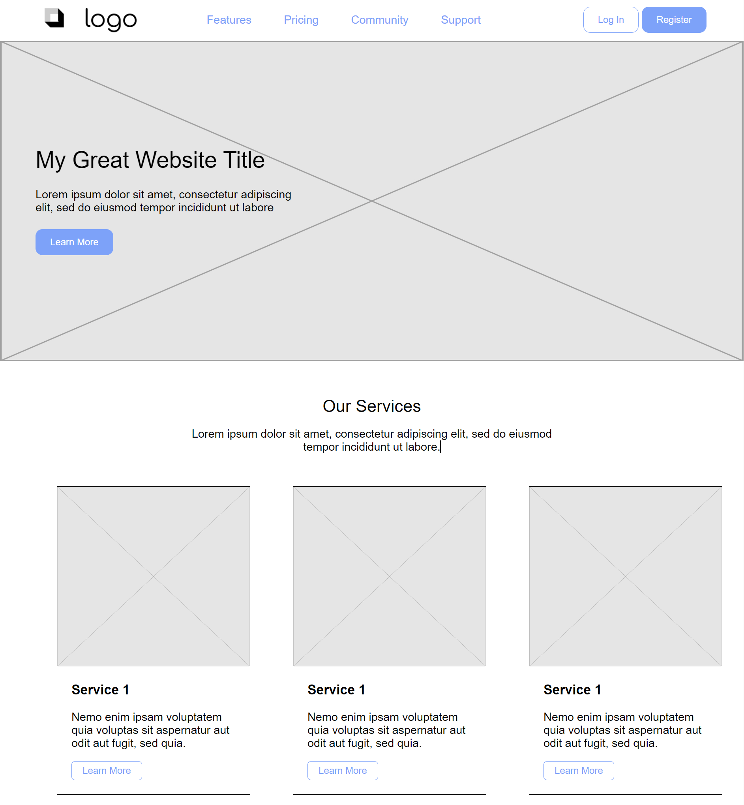

# Diploma of Information Technology

## Classes

### Class 1 (16th Apr 2024)
- Introduction to the course
- Meet 'n greet
- Basic structure of a website
- Getting started with VS Code, HTML & Live Server
- Basic HTML, playing around etc.

### Class 2 (18th Apr 2024)
- Further dive into HTML tags
- Proper structure of a HTML page (head, body, footer)
- Linking multiple pages together
- Inline styling (I jumped ahead and linked a style.css to keep my pages consistent.)

### Class 3 (23rd Apr 2024)
- Recreate a website

### Class 4 (30th Apr 2024)
I was unable to attend this class, but I caught up on the 1st May.
- Creating tables using HTML
- Linking a stylesheet and using a style.css file
- Blockquote, creating classes, styling classes and tags independently
- Button styles, hovering, transition effect

### Class 5 (2nd May 2024)
- Creating a website based off a given wireframe PDF
- Experimenting with styling multiple classes, flex, grids, primary/secondary buttons

### Class 6 (7th May 2024)
- Online assessment 'Originate and Develop Concepts' (no coding required)

### Class 7 (9th May 2024)
- Introduction to Flexbox
- Revisiting Class-5 wireframing using flex components

### Class 8 (14th May 2024)
- Continue Class-7 wireframing using flex, introducing fonts, font-icons and creating a personal touch

### Class 9 (16th May 2024)
- Introduction to CSS grids
- Responsive media queries

### Class 10 (28th May 2024)
- Introduction to bootstrap (skipped class)
- Using bootstrap grids, headings, buttons etc.

### Class 11 (30th May 2024)
Refer to subfolder 'Skywings'
- Further dive into bootstrap
- Building demo website 'Skywings' to test knowledge thus far

### Class 12 (4th June 2024)
- Further developing Skywings
- New concpets, lazy loading

### Class 13 (6th June 2024)
- Group development of Home page for Skywings
- Assessment to develop a unique page for Skywings
- Gather resources for Skywings Australia webpage

### Class 14 (11th June 2024)
- Developing Skywings page for assessment

### Class 15 (13th June 2024)

### Class 16 (18th June 2024)

### Class 17 (20th June 2024)

### Class 18 (25th June 2024)

### Class 19 (27th June 2024)